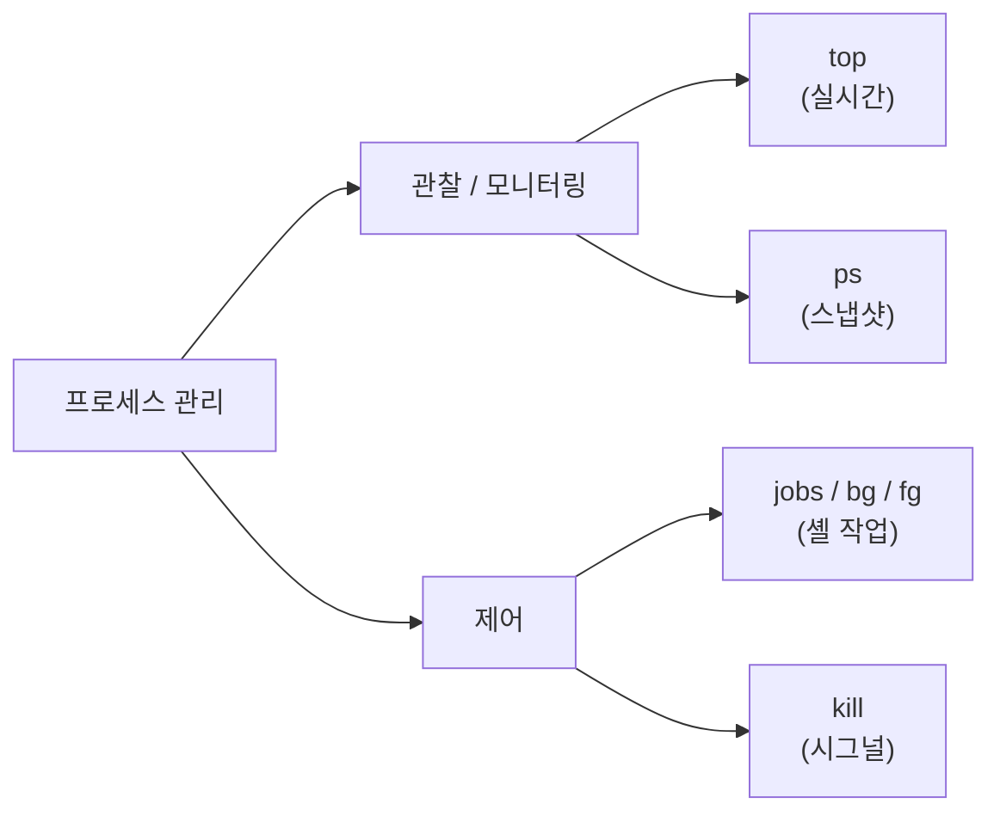
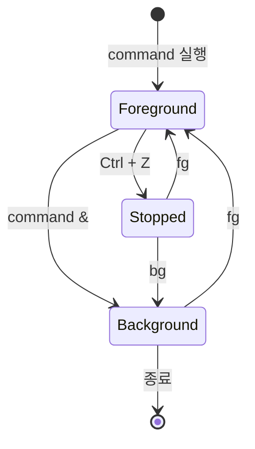

# python_assignment1
# 리눅스 프로세스 관리 명령어 정리


> 리눅스에서 **프로세스(Process)** 와 **작업(Job)** 을 관리하는 핵심 명령어 `top`, `ps`, `jobs`, `kill` 을 정리한 문서입니다.

---

## 목차

- [개요](#-개요)
- [1. top - 실시간 모니터링](#1-top--실시간-모니터링)
- [2. ps - 프로세스 스냅샷](#2-ps--프로세스-스냅샷)
- [3. jobs - 셸 작업 관리](#3-jobs--셸-작업-관리)
- [4. kill - 시그널 전송](#4-kill--시그널-전송)
- [명령어 한눈에 비교](#-명령어-한눈에-비교)
- [실전 시나리오](#-실전-시나리오)
- [참고 자료](#-참고-자료)

---

## 개요

리눅스에서 실행 중인 모든 프로그램은 **프로세스**라는 단위로 관리되며, 각 프로세스는 고유한 **PID(Process ID)** 를 가집니다. 시스템 자원을 효율적으로 쓰고 멈춘 프로그램을 정리하려면 프로세스를 **관찰**하고 **제어**할 수 있어야 합니다.



| 분류 | 명령어 | 한 줄 설명 |
|:---:|:---:|:---|
| 관찰 | `top` | 자원 사용량을 **실시간**으로 갱신하며 보여줌 |
| 관찰 | `ps` | 특정 시점의 프로세스 목록을 **정적**으로 출력 |
| 제어 | `jobs` | 현재 셸의 백그라운드·중지 작업을 관리 |
| 제어 | `kill` | 프로세스에 **시그널**을 보내 종료·일시정지 등 수행 |

---

## 1. `top` - 실시간 모니터링

> 시스템의 CPU·메모리 사용량과 프로세스 목록을 **실시간으로 갱신**하며 보여주는 모니터링 도구입니다. (Windows의 작업 관리자와 유사)

###  기본 사용

```bash
top
```

###  출력 예시

```text
top - 14:32:07 up  3:18,  2 users,  load average: 0.42, 0.55, 0.59
Tasks: 213 total,   1 running, 212 sleeping,   0 stopped,   0 zombie
%Cpu(s):  3.1 us,  1.2 sy,  0.0 ni, 95.4 id,  0.3 wa,  0.0 hi,  0.0 si
MiB Mem :  15998.3 total,   6021.7 free,   4210.5 used,   5766.1 buff/cache
MiB Swap:   2048.0 total,   2048.0 free,      0.0 used.  11200.9 avail Mem

  PID USER      PR  NI    VIRT    RES    SHR S  %CPU  %MEM     TIME+ COMMAND
 1842 panta     20   0 2891.5m 312.1m  98.4m S  12.3   1.9   1:24.55 chrome
  990 root      20   0  512.2m  44.8m  22.1m S   1.0   0.3   0:18.02 Xorg
    1 root      20   0  168.9m  12.4m   8.9m S   0.0   0.1   0:02.31 systemd
```

###  주요 옵션

| 옵션 | 설명 | 예시 |
|:---:|:---|:---|
| `-d` | 갱신 간격(초) 지정 | `top -d 2` |
| `-u` | 특정 사용자의 프로세스만 | `top -u panta` |
| `-p` | 특정 PID만 모니터링 | `top -p 1842` |
| `-n` | 지정 횟수만 갱신 후 종료 | `top -n 3` |

###  실행 중 단축키 (인터랙티브)

- <kbd>q</kbd> : top 종료
- <kbd>P</kbd> : **CPU 사용률** 순 정렬 (기본값)
- <kbd>M</kbd> : **메모리 사용률** 순 정렬
- <kbd>k</kbd> : 프로세스에 시그널 전송(kill)
- <kbd>1</kbd> : CPU 코어별 사용량 개별 표시
- <kbd>h</kbd> : 도움말

>  **Tip** - 더 현대적인 UI와 색상, 마우스 조작을 원한다면 `htop` 을 설치해 보세요. (`sudo apt install htop`)

---

## 2. `ps` - 프로세스 스냅샷

> 명령을 실행한 **순간의** 프로세스 목록을 한 번 출력합니다. `top`이 동영상이라면 `ps`는 **사진 한 장**입니다.

###  자주 쓰는 조합

```bash
ps aux        # BSD 스타일 - 모든 사용자의 모든 프로세스
ps -ef        # System V 스타일 - 부모 PID(PPID) 포함
ps aux | grep chrome   # 특정 프로세스 검색
```

###  출력 예시 (`ps aux`)

```text
USER   PID %CPU %MEM    VSZ   RSS TTY  STAT START   TIME COMMAND
root     1  0.0  0.1 168912 12716 ?   Ss   11:14   0:02 /sbin/init
panta 1842 12.3  1.9 2961240 319616 ? Sl  13:08   1:24 /opt/chrome
panta 2310  0.0  0.0  10112  3204 pts/0 R+ 14:32   0:00 ps aux
```

###  `ps aux` 컬럼 의미

| 컬럼 | 의미 |
|:---|:---|
| `USER` | 프로세스 소유자 |
| `PID` | 프로세스 고유 번호 |
| `%CPU` / `%MEM` | CPU / 메모리 사용률 |
| `VSZ` | 가상 메모리 크기(KB) |
| `RSS` | 실제 물리 메모리 크기(KB) |
| `STAT` | 프로세스 상태 (아래 표 참고) |
| `COMMAND` | 실행된 명령어 |

###  STAT(상태) 코드

| 코드 | 상태 | 설명 |
|:---:|:---|:---|
| `R` | Running | 실행 중 또는 실행 대기 |
| `S` | Sleeping | 이벤트를 기다리며 대기 |
| `D` | Uninterruptible | I/O 등으로 중단 불가 대기 |
| `T` | Stopped | 중지됨 (`Ctrl+Z` 등) |
| `Z` | Zombie | 종료됐지만 부모가 회수 안 함 |

>  보조 문자: `s`(세션 리더), `+`(포그라운드), `l`(멀티스레드), `<`(높은 우선순위)

---

## 3. `jobs` - 셸 작업 관리

> 현재 **터미널(셸) 세션**에서 실행한 백그라운드·중지 상태의 작업(job)을 보여줍니다. `top`/`ps`가 시스템 전체를 본다면, `jobs`는 **내 셸 안의 작업**만 봅니다.

###  백그라운드 작업 흐름



###  관련 명령어 세트

| 동작 | 명령 | 설명 |
|:---|:---|:---|
| 백그라운드 실행 | `command &` | 명령을 백그라운드로 바로 실행 |
| 일시 중지 | <kbd>Ctrl</kbd>+<kbd>Z</kbd> | 현재 작업을 중지(Stopped) |
| 작업 목록 | `jobs` | 작업 번호와 상태 확인 |
| 백그라운드로 재개 | `bg %1` | 1번 작업을 백그라운드에서 실행 |
| 포그라운드로 복귀 | `fg %1` | 1번 작업을 포그라운드로 |

###  사용 예시

```bash
$ sleep 300 &
[1] 2451

$ ping google.com > ping.log &
[2] 2452

$ jobs
[1]-  Running    sleep 300 &
[2]+  Running    ping google.com > ping.log &
```

###  주요 옵션

- `jobs -l` : 작업 번호와 함께 **PID** 표시
- `jobs -r` : **실행 중(Running)** 작업만 표시
- `jobs -s` : **중지(Stopped)** 작업만 표시

>  `jobs`로 보이는 작업 번호(`%1`)와 `ps`의 PID는 **다른 개념**입니다. 작업 번호는 셸 내부 번호, PID는 시스템 전역 번호입니다.

---

## 4. `kill` - 시그널 전송

> 프로세스에 **시그널(Signal)** 을 보내 종료·일시정지·재개 등을 수행합니다. 이름은 'kill'이지만 실제로는 "**신호를 보내는**" 명령어입니다.

###  기본 사용

```bash
kill 2451            # 기본 시그널(SIGTERM, 15) 전송 - 정상 종료 요청
kill -9 2451         # SIGKILL(9) - 강제 종료
kill -SIGTERM 2451   # 시그널 이름으로 지정
kill %1              # 셸 작업 번호로 지정
kill -l              # 전체 시그널 목록 출력
```

###  주요 시그널

| 번호 | 이름 | 의미 | 무시 가능? |
|:---:|:---|:---|:---:|
| `1` | `SIGHUP` | 터미널 연결 끊김 / 설정 재로드 | O |
| `2` | `SIGINT` | 인터럽트 (<kbd>Ctrl</kbd>+<kbd>C</kbd>) | O |
| `9` | `SIGKILL` | **강제 종료** (무시·차단 불가) | X |
| `15` | `SIGTERM` | **정상 종료 요청** (기본값) | O |
| `18` | `SIGCONT` | 중지된 프로세스 재개 | - |
| `19` | `SIGSTOP` | 프로세스 일시 중지 (차단 불가) | X |

###  `SIGTERM(15)` vs `SIGKILL(9)`

| 구분 | `kill -15` (SIGTERM) | `kill -9` (SIGKILL) |
|:---|:---|:---|
| 성격 | "정리하고 종료해줘" (정중한 요청) | "당장 끝내" (강제) |
| 프로세스 대응 | 저장·정리 작업 후 종료 가능 | 곧바로 강제 종료 |
| 데이터 손실 위험 | 낮음 | 높음 |
| 권장 순서 | **먼저 시도** | TERM이 안 통할 때 |

>  `kill -9` 는 프로세스가 임시 파일이나 데이터를 정리할 틈 없이 죽이므로, **항상 `kill`(SIGTERM)을 먼저** 시도하고 안 될 때만 사용하세요.

###  관련 명령어

- `killall firefox` : **프로세스 이름**으로 한꺼번에 종료
- `pkill -u panta` : **패턴/조건**으로 종료 (사용자, 이름 등)
- `kill -9 $(pgrep chrome)` : 이름으로 PID를 찾아 종료

---

##  명령어 한눈에 비교

| 항목 | `top` | `ps` | `jobs` | `kill` |
|:---|:---:|:---:|:---:|:---:|
| 목적 | 실시간 모니터링 | 프로세스 조회 | 셸 작업 관리 | 프로세스 제어 |
| 갱신 방식 | 동적(실시간) | 정적(1회) | 정적 | - |
| 관찰 범위 | 시스템 전체 | 시스템 전체 | 현재 셸 | 지정 대상 |
| 식별 단위 | PID | PID | 작업 번호 / PID | PID / 작업 번호 |

---

##  실전 시나리오

**"브라우저가 멈췄을 때 강제로 닫기"**

```bash
# 1) 멈춘 프로세스의 PID 찾기
ps aux | grep firefox

# 2) 정상 종료 먼저 시도
kill 3120

# 3) 그래도 안 죽으면 강제 종료
kill -9 3120
```

**"오래 걸리는 작업을 백그라운드로 돌리고 관리하기"**

```bash
./build.sh &     # 백그라운드 실행
jobs             # 작업 상태 확인
top              # CPU/메모리 부하 모니터링
fg %1            # 다시 앞으로 가져와 로그 보기
```

---

##  참고 자료

- 각 명령어의 공식 매뉴얼: `man top`, `man ps`, `man kill`, `help jobs`
- [The Linux man-pages project](https://man7.org/linux/man-pages/)
- [GNU Bash Reference - Job Control](https://www.gnu.org/software/bash/manual/)

---

